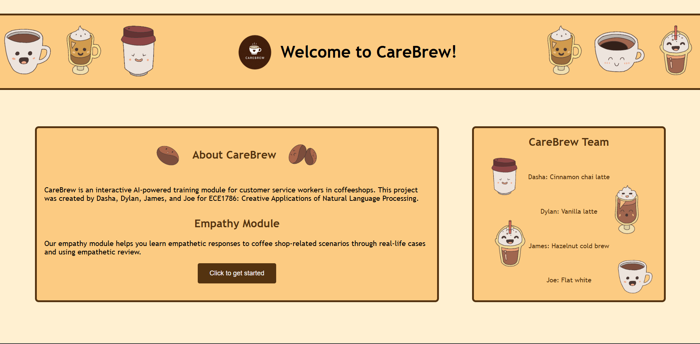
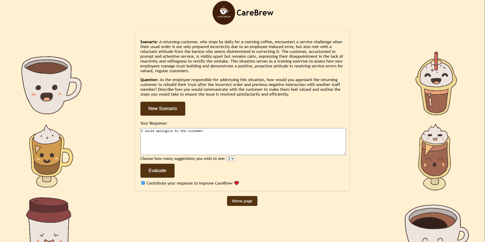
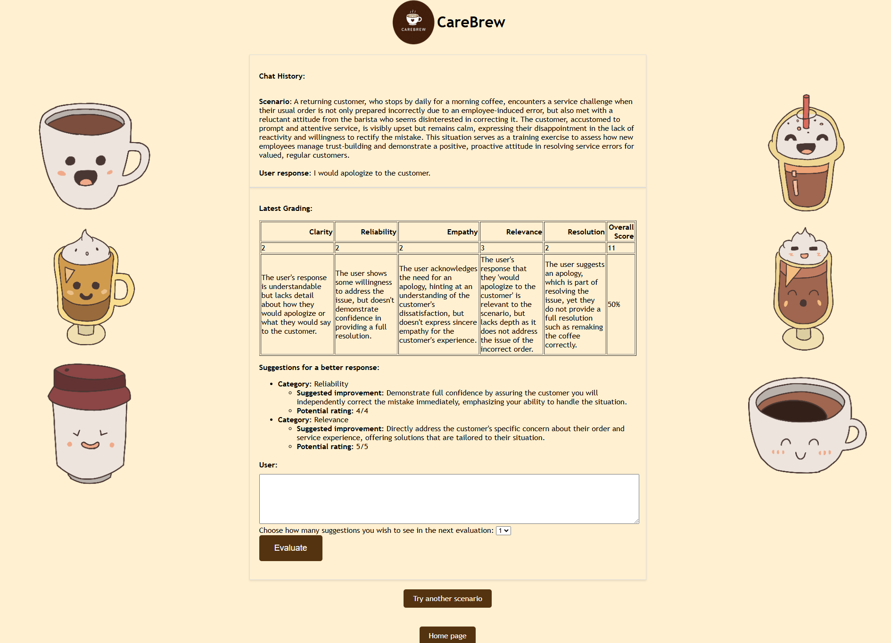
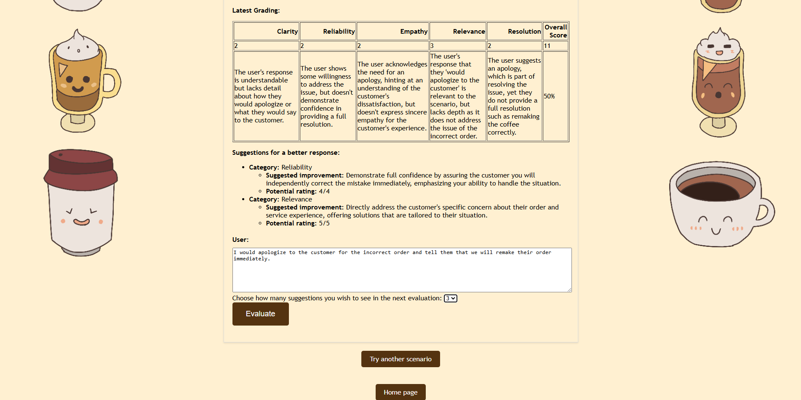
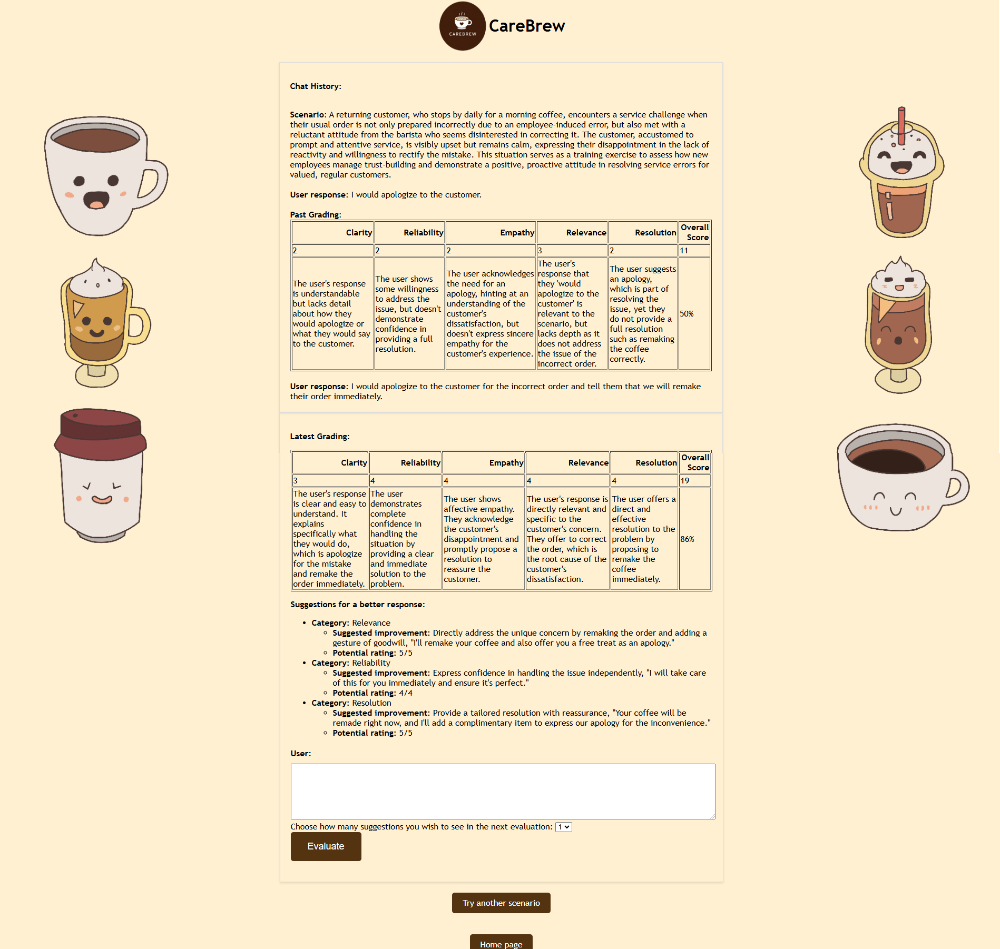

Recommended Python Version 3.12.4 <br>
Recommended pip version 24.0

# CareBrew

CareBrew is an interactive AI-powered website that teaches coffee shop employees how to respond to customer service scenarios. This project was created by Dylan, Dasha, James, and Joe for ECE1786: Creative Applications of Natural Language Processing.

## Table of Contents

1. [Running CareBrew](#running-carebrew)
2. [Using CareBrew](#using-carebrew)

## Running CareBrew

Follow these steps to set up the project locally:

1. **Clone Responsitory**

```bash
git clone https://github.com/ece1786-2024/CareBrew.git

cd CareBrew
```

2. **Set Up Virtual Environment**

```bash
python -m venv env

source env/bin/activate # Mac
env\Scripts\activate # Windows
```

3. **Install Dependencies**

```bash
pip install -r requirements.txt
```

4. **Set Up Environment Variables**

```bash
OPENAI_API_KEY="your-secret-key"
```

5. **Run Website**

```bash
app.py
```

6. **Navigate to Website**

Open browser and navigate to http://127.0.0.1:5000

## Using CareBrew

CareBrew's homepage features some information about CareBrew, our team, and a button to access our Empathy Module.



Clicking the `Click to get started` button will take you to our Empathy Module, where you will be presented with a scenario.



Generate a new scenario by clicking `New Scenario`, or type a response to the customer service scenario in the text box and select the number of suggestions you want to receive from the drop-down menu and click `Evaluate`.

You will then be presented with a critical evaluation of your response and a number of suggestions for improvement.



You can then either attempt a new scenario by clicking `Try another scenario`, or continue with the current scenario by again entering your new response in the text box, selecting the number of suggestions, and clicking `Evaluate`.



You will then be presented with another critical evaluation of your response and a number of suggestions for improvemen, with your previous responses shown in the chat history.



At any point in time, return to the homepage by clicking the `Home page` button.